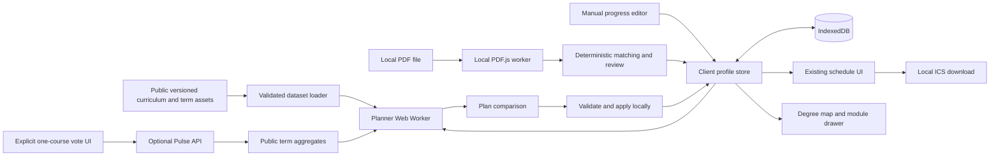

# Target architecture

The delivered release uses Next.js 16 App Router, React 19, strict TypeScript, Tailwind 4 and the existing Radix primitives. The framework upgrade addressed production security advisories; academic architecture and ScheduleHAW identity are preserved. Public curriculum/term packages are static; private academic inputs live only in client memory/IndexedDB. The optional Pulse API does not import profile persistence or planner input types. Current implementation decisions and verification are in [IMPLEMENTATION_REPORT.md](IMPLEMENTATION_REPORT.md).



## Boundaries and code ownership

| Layer | Contract | Forbidden dependencies |
|---|---|---|
| `lib/domain` | Types, schemas, truth/status/credit/eligibility functions | React, window, fetch, DB, AI |
| `lib/planner` | generatePlans(PlannerInput), scoring, constraints, search | UI, persistence, network |
| `lib/schedule` | Occurrence expansion, overlaps, metrics, selection resolution | Private network operations |
| `lib/persistence` | ProfileRepository, IndexedDB adapter, schema migrations | Server routes, Pulse |
| `lib/transcript` | Local extraction and parser proposals | Network/OCR/AI calls; automatic saves |
| `lib/community` | Narrow PulseVote/PulseAggregate DTOs | StudentProfile, grades, plan payloads |
| `Components/*` | Bilingual accessible presentation and user intents | Duplicated academic rules |

The server renders public shells only. A top-level client provider hydrates profile after mount; server components never receive the academic profile as props or serialize it into HTML/RSC. No server actions for progress, import or plan generation. Route/query strings contain only screen/term public identifiers, not student selection, grades or plan state. Avoid analytics/session replay; error messages are scrubbed codes.

## Target file structure

```text
app/
  layout.tsx                  # Public layout; existing metadata
  page.tsx                    # Keep existing / entry, route to Schedule shell
  providers.tsx               # Client locale/profile/dataset providers
  advisor/page.tsx
  progress/page.tsx
  progress/import/page.tsx
  schedule/page.tsx
  degree-map/page.tsx
  api/pulse/route.ts          # P1, only if feature enabled and deployed
Components/
  navigation/AppShell.tsx
  onboarding/Onboarding.tsx
  progress/{ProgressScreen,ModuleProgressCard,ComponentEditor,ProfileTools}.tsx
  advisor/{AdvisorScreen,PreferencesForm,PlanComparison,PlanCard,ReasonList}.tsx
  degree/{DegreeMap,DegreeList,ModuleDrawer,MilestoneNode}.tsx
  transcript/{LocalFilePicker,ImportReview,ImportRow}.tsx
  community/{PulsePanel,PulseVoteControls}.tsx
  schedule/{ScheduleFilters,ScheduleGrid,ScheduleBlock,WeekTimeline,ConflictDetector}.tsx
  schedule/{MobileAgenda,ExportDialog,GroupComparison}.tsx
Pages/Schedule.tsx            # Existing integration shell retained during migration
lib/
  domain/{types,schemas,requirements,status,credits,eligibility,graph}.ts
  data/{loaders,validate,legacyScheduleAdapter,aliases}.ts
  persistence/{repository,indexedDb,migrations,profileStore}.ts
  planner/{index,actions,weights,rank,search,explain,applyPlan}.ts
  schedule/{occurrences,overlap,metrics,selection,timezone}.ts
  transcript/{extract,registry,normalize,match,merge}.ts
  transcript/adapters/{hawTextTableV1,hawPortalTextV1}.ts
  i18n/{provider,translate,reasonKeys}.tsx
  community/{contracts,client,server,rateLimit}.ts
  icsGenerator.ts             # Existing public download facade; corrected implementation
workers/{planner,pdfExtract}.worker.ts
messages/{en,de}.json
data/                        # See DATA_MODEL.md
scripts/{migrate-legacy,validate-data,validate-i18n}.ts
tests/{unit,integration,e2e,fixtures}/
```

Preserve existing capitalized `Components`, `Pages`, `Entities` paths; do not make casing-only renames on Windows. New modules stay under `lib`; no top-level `src/` relocation. Shared types are independent of API/database types.

## Libraries and integration decisions

Use `idb` (small typed IndexedDB wrapper) behind ProfileRepository, `zod` for import/public-data schemas, `@js-temporal/polyfill` for explicitly zoned calendar conversion, and Vitest + Testing Library + fake-indexeddb for tests; Playwright for complete browser/network flows. Pin compatible reviewed versions and lockfile at implementation, not guessed version numbers in this spec. Existing installed stack remains until a deliberate supported security-update check at release. Do not introduce a global state framework: reducer/context with separate profile and locale contexts is enough at this scale; derive memoized selectors from immutable snapshots.

Use `@xyflow/react` only on the degree-map route, dynamically loaded with SSR disabled. A deterministic semester-column layout avoids a layout-engine dependency. Keep a list alternative and read the current [React Flow accessibility guidance](https://reactflow.dev/learn/advanced-use/accessibility). Keep node semantics independent from graph renderer so this library can be replaced.

Use lazy-loaded `pdfjs-dist` with a same-origin bundled worker; see [PDF.js examples](https://mozilla.github.io/pdf.js/examples/). Keep PDF.js worker version identical to library version, no CDN loader. No AI SDK, hosted OCR or transcript API is part of V1.

## Client orchestration

Hydration states are loading, ready, memory-only, failed. Never overwrite disk with an empty default profile before asynchronous load finishes. Expose save status and serialize writes; catch errors and preserve the last durable snapshot. Components dispatch domain actions; one store applies them and saves the full profile with expected revision. Broadcast revision changes across tabs; notify on conflicts instead of last-writer-wins data loss.

Planner Worker uses typed messages, request IDs, profile revision and dataset versions. Latest-request-wins: ignore old results after preference changes/reset. Worker receives a structured-cloned academic snapshot entirely within the device. It returns reasons/metrics, not formatted strings. Use `new Worker(new URL(..., import.meta.url))` through a bundler-compatible client factory and verify the production build serves the correct asset. Cancellation must yield or terminate the worker; an endless synchronous worker cannot receive cancel messages promptly.

`Use this plan` goes through `applyPlan`, saves selection, opens Schedule and announces the selection. Filters then only alter the visible view. Term-wide conflict summary and full-term ICS both use the authoritative selection, independent from instructor/week filters. Manual course selection resolves to exact groups and shared sessions through the same resolver; unsupported legacy mappings remain browseable with a data warning.

## ICS contract

Preserve `downloadICS` as UI facade; target signature `generateICS({term, occurrences, generatedAt, locale, scope})`. Input occurrences already resolve selected groups, removals and exact dates; export has no week-expansion heuristics. Use one VEVENT per occurrence in V1. Stable UID includes term ID and occurrence ID; DTSTAMP is injected `generatedAt`. Emit UTC DTSTART/DTEND from Europe/Berlin with DST rules, CRLF, TEXT escaping and UTF-8 octet-aware folding at 75 octets. Validate with an independent parser against [RFC 5545](https://www.rfc-editor.org/info/rfc5545/).

Full-term selection is default export. Current week and visible-filter export are explicit optional scopes with a summary before download. Do not export inferred exams with no date. Break events are opt-in and sourced; all-day DTEND is exclusive. Reject nonexistent/ambiguous local times rather than trusting browser timezone. Duplicate UIDs are an error. Calendar title/file name use term config. Correct 2025/26 historical export remains a regression fixture while synthetic 2026/27 tests prove no embedded year dependency.

## Offline / PWA evaluation

Local computation and persistence already remove advisor roundtrips after public data loads. Full offline reload requires an app shell and package cache: add only in P2 after the core ships. Proposed minimal PWA: manifest/icons + service worker caching hashed static assets and explicit public curriculum/term packages; navigation fallback to cached shell; an update notice and versioned cache retirement. Never cache PDF bytes, export blobs, profile payloads, API votes or personalized HTML. Pin curriculum/term together per active session; do not swap half a package during a worker run. Show asset version and last publication date offline. Until PWA is implemented, state "works offline while open", not "offline reload supported".

## Error and observability policy

Typed errors: `DATA_INVALID`, `DATA_UNAVAILABLE`, `PROFILE_CONFLICT`, `STORAGE_UNAVAILABLE`, `QUOTA_EXCEEDED`, `UNSUPPORTED_PROFILE_VERSION`, `STALE_PLAN`, `SEARCH_INCOMPLETE`, `PDF_UNREADABLE`, `PULSE_UNAVAILABLE`. UI explains recovery with translated text. No automatic remote exception reporting that captures component props, localStorage, profile, PDF text or notes. Development diagnostics use synthetic fixtures; production health metrics, if later added, must be separately designed and opt-in.
